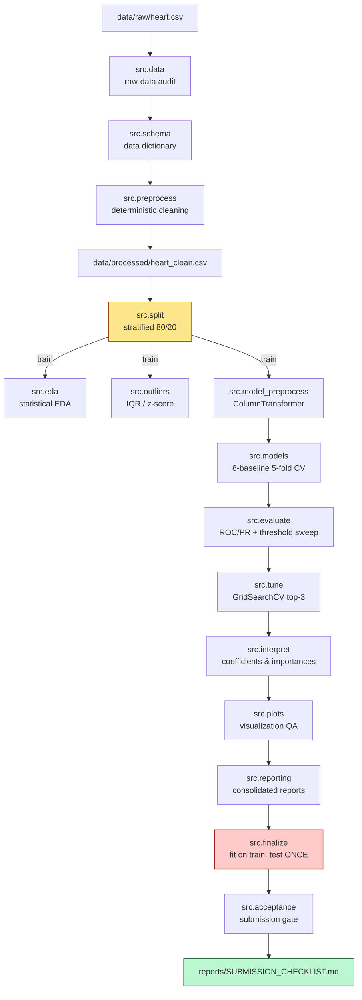
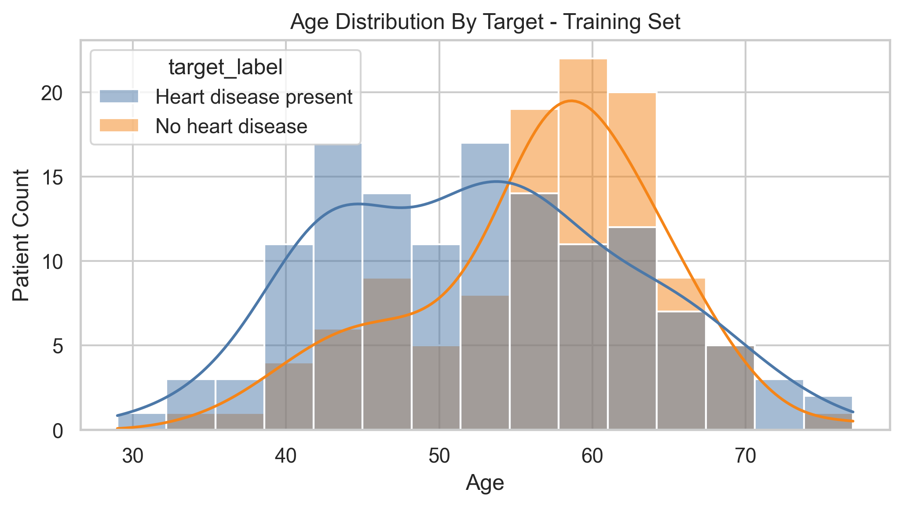
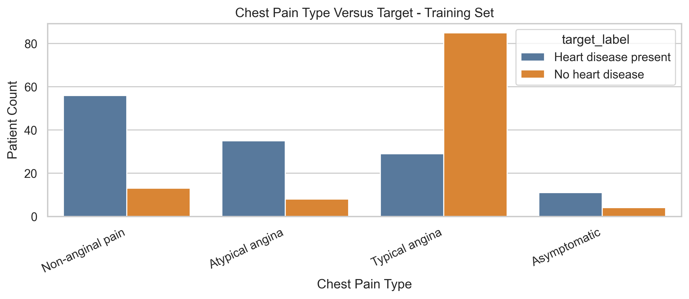
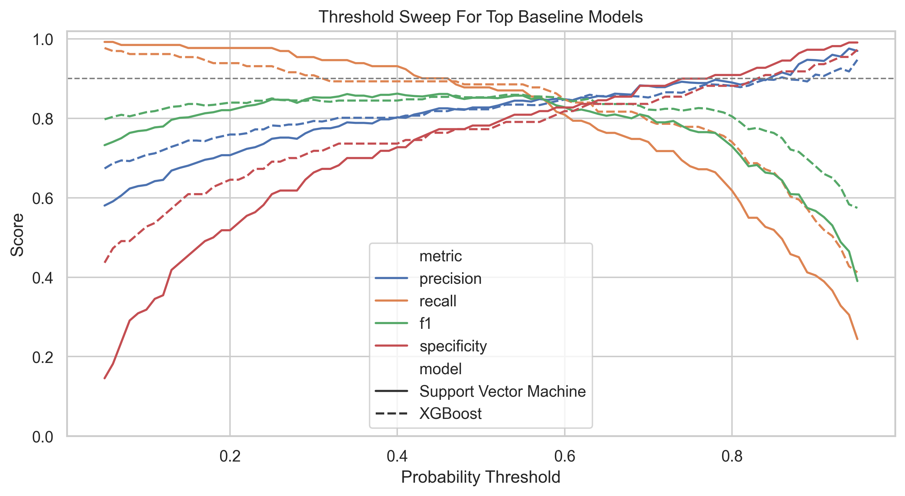
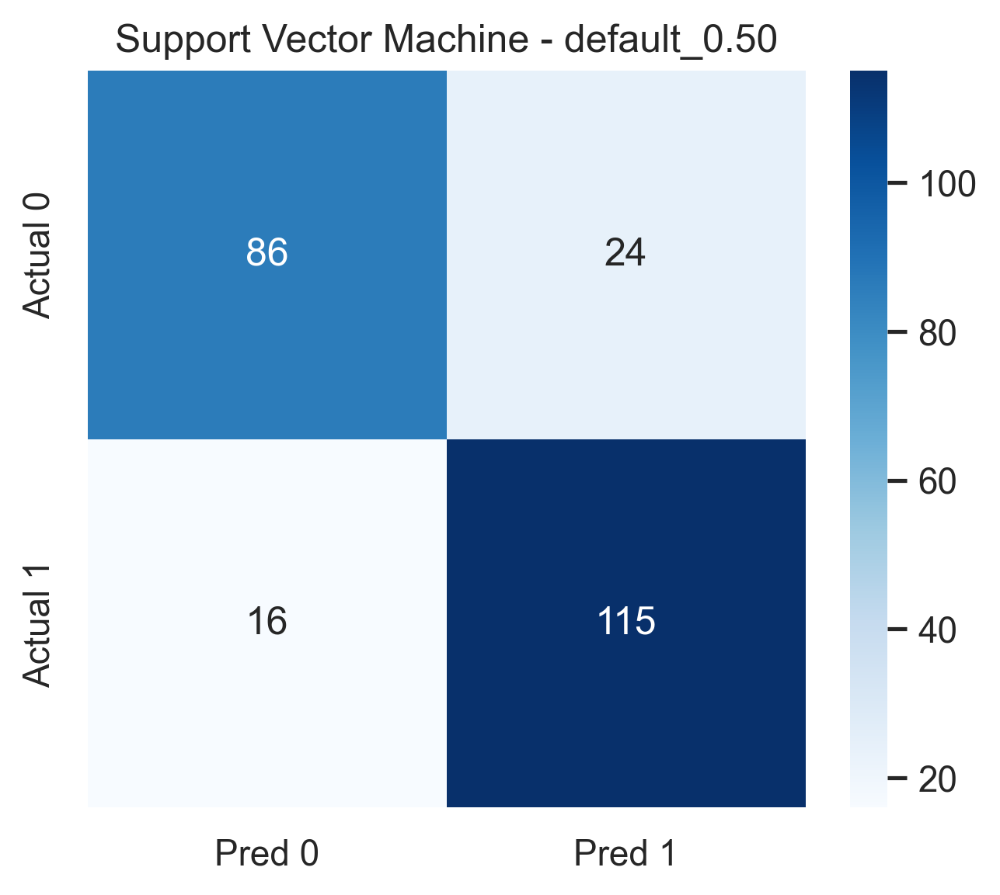
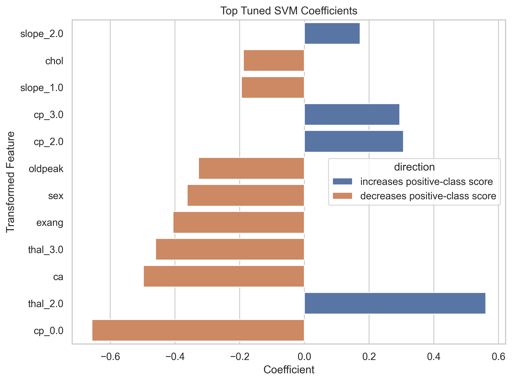
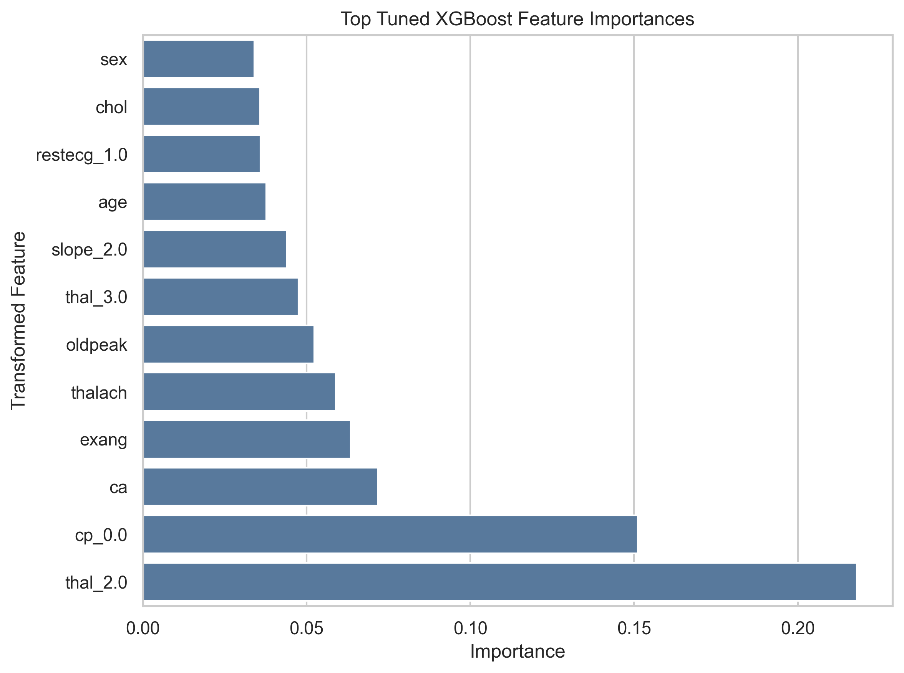
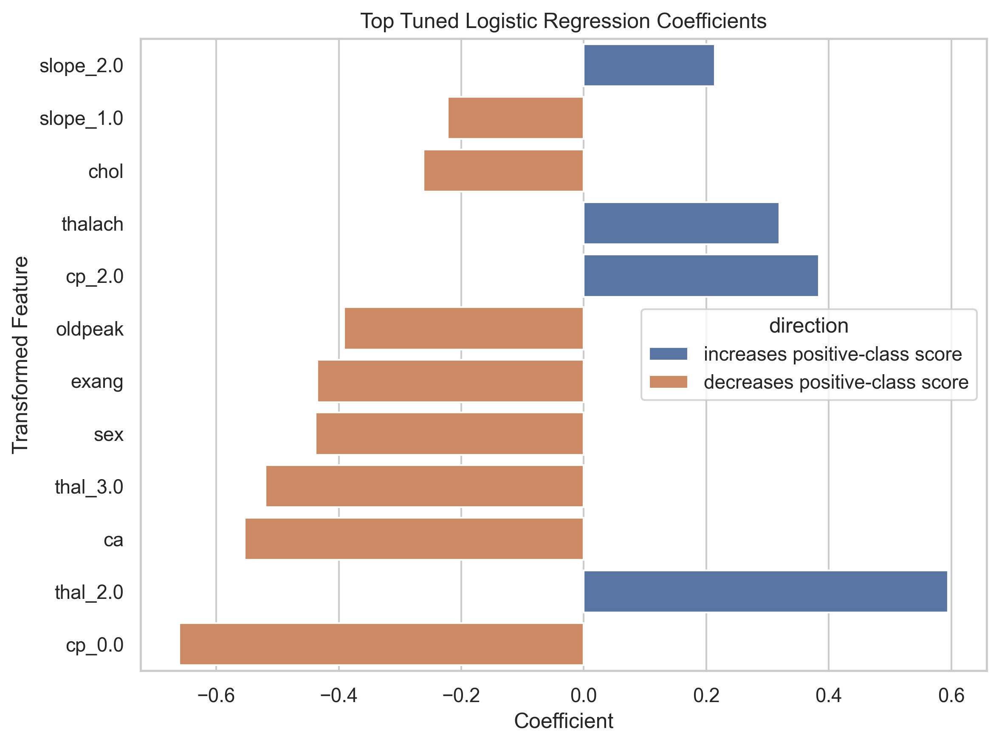

# Heart Disease Risk Prediction

An end-to-end, reproducible data-mining and machine-learning project that predicts heart-disease risk on the Cleveland dataset. The project follows a strict train/test discipline, compares eight classifiers under stratified 5-fold cross-validation, tunes the top candidates, locks a recall-priority operating point, and evaluates the held-out test set **exactly once**.

> **Final model:** Support Vector Machine (linear, C = 0.1) · **Locked threshold:** 0.40 · **Held-out recall:** 0.909 · **ROC-AUC:** 0.912 · **F1:** 0.811

---

## Table of Contents

1. [Highlights](#highlights)
2. [Results at a Glance](#results-at-a-glance)
3. [Project Structure](#project-structure)
4. [End-to-End Pipeline](#end-to-end-pipeline)
5. [Orchestration](#orchestration)
6. [Setup](#setup)
7. [One-Command Reproducibility](#one-command-reproducibility)
8. [Stage-by-Stage Commands](#stage-by-stage-commands)
9. [Exploratory Data Analysis](#exploratory-data-analysis)
10. [Modelling & Evaluation](#modelling--evaluation)
11. [Interpretation](#interpretation)
12. [Reports & Artifacts](#reports--artifacts)
13. [Testing](#testing)
14. [Reproducibility & Determinism](#reproducibility--determinism)

---

## Highlights

- **16 fully tested `src/` modules** covering the entire ML lifecycle — from raw data audit to final acceptance gate.
- **Strict data hygiene:** the test split is created once and is **never** touched until the final evaluation step.
- **8 baselines** compared under stratified 5-fold CV (Dummy, Logistic Regression, KNN, SVM, Decision Tree, Random Forest, Gaussian NB, Gradient Boosting, XGBoost).
- **Recall-priority threshold tuning** — false negatives are weighted as more serious than false positives.
- **Multi-angle interpretation:** logistic coefficients, SVM coefficients, XGBoost gains, and permutation importance.
- **32 publication-quality figures** (300 dpi) and **57 result CSVs** generated automatically.
- **One-command reproducibility** via `python -m src.run_all` with a programmatic acceptance gate.

---

## Results at a Glance

### Held-Out Test Metrics — Final Locked Model (SVM, threshold = 0.40)

| Metric              | Value  |
|---------------------|-------:|
| Recall (sensitivity)| 0.909  |
| ROC-AUC             | 0.912  |
| Average Precision   | 0.927  |
| F1 Score            | 0.811  |
| Precision           | 0.732  |
| Specificity         | 0.607  |
| Accuracy            | 0.770  |
| False Negatives     | 3      |
| False Positives     | 11     |

### Cross-Validated Model Comparison (out-of-fold, threshold = 0.50)

| Model                  | ROC-AUC | F1     | Recall | Precision |
|------------------------|--------:|-------:|-------:|----------:|
| Logistic Regression    | 0.912   | 0.857  | 0.870  | 0.844     |
| **Support Vector Machine** | **0.900** | **0.852** | **0.878** | **0.827** |
| XGBoost                | 0.901   | 0.853  | 0.885  | 0.823     |
| Random Forest          | 0.900   | 0.837  | 0.863  | 0.813     |
| Gaussian NB            | 0.858   | 0.835  | 0.870  | 0.803     |
| K-Nearest Neighbors    | 0.882   | 0.840  | 0.863  | 0.819     |
| Gradient Boosting      | 0.868   | 0.819  | 0.847  | 0.793     |
| Decision Tree          | 0.760   | 0.787  | 0.802  | 0.772     |
| Dummy (Stratified)     | 0.496   | 0.577  | 0.618  | 0.540     |


---

## Project Structure

```text
Heart-Disease-Risk-Prediction/
├── data/
│   ├── raw/                       # Original Cleveland CSV (never modified)
│   └── processed/                 # Cleaned snapshot (regenerated)
├── notebooks/
│   ├── 01_eda.ipynb               # Narrative EDA over src/eda.py
│   └── 02_modelling.ipynb         # Narrative modelling over src/models.py
├── src/                           # 16 reusable, tested modules
│   ├── data.py                    # Raw-data audit
│   ├── schema.py                  # Data dictionary & validation
│   ├── preprocess.py              # Deterministic cleaning
│   ├── eda.py                     # Statistical EDA (train-only)
│   ├── outliers.py                # IQR / z-score detection
│   ├── split.py                   # Stratified 80/20 split
│   ├── model_preprocess.py        # ColumnTransformer pipeline
│   ├── models.py                  # 8-baseline CV comparison
│   ├── evaluate.py                # ROC/PR, threshold sweep, OOF
│   ├── tune.py                    # GridSearchCV on top candidates
│   ├── interpret.py               # Coefficients & importances
│   ├── plots.py                   # Visualization QA layer
│   ├── reporting.py               # Consolidated reports
│   ├── finalize.py                # Fit-on-train, score-on-test ONCE
│   ├── acceptance.py              # Submission gate
│   └── run_all.py                 # End-to-end orchestrator
├── tests/                         # pytest suite for every src module
├── outputs/
│   ├── figures/                   # 32 × 300 dpi PNGs
│   ├── models/                    # final_model.joblib (gitignored)
│   └── results/                   # 57 result CSVs
├── reports/                       # 17 Markdown reports
├── requirements.txt               # Pinned dependencies
└── README.md
```

---

## End-to-End Pipeline



**Key discipline:** the held-out test fold produced by `src.split` is sealed until `src.finalize`. Every intermediate stage operates on the training split only.

---

## Orchestration

| # | Stage                  | Command                            | Inputs                          | Key Outputs                                                                |
|---|------------------------|------------------------------------|---------------------------------|----------------------------------------------------------------------------|
| 1 | Raw-data audit         | `python -m src.data`               | `data/raw/heart.csv`            | `reports/INITIAL_DATA_AUDIT.md`, 6 audit CSVs                              |
| 2 | Schema & dictionary    | `python -m src.schema`             | raw CSV                         | `reports/DATA_DICTIONARY.md`, validation CSVs                              |
| 3 | Cleaning               | `python -m src.preprocess`         | raw CSV                         | `data/processed/heart_clean.csv`, `DATA_CLEANING_REPORT.md`                |
| 4 | EDA                    | `python -m src.eda`                | clean CSV (train only)          | 10 figures + 9 CSVs, `EXPLORATORY_DATA_ANALYSIS.md`                        |
| 5 | Outlier detection      | `python -m src.outliers`           | clean CSV (train only)          | 7 figures + IQR/z-score CSVs, `OUTLIER_DETECTION_REPORT.md`                |
| 6 | Preprocessor inspection| `python -m src.model_preprocess`   | clean CSV                       | column routing CSV, `PREPROCESSING_PIPELINE_REPORT.md`                     |
| 7 | Baseline comparison    | `python -m src.models`             | clean CSV                       | `cv_results.csv`, `BASELINE_MODEL_COMPARISON.md`                           |
| 8 | OOF evaluation         | `python -m src.evaluate`           | clean CSV                       | ROC/PR/threshold figures, `MODEL_EVALUATION_REPORT.md`                     |
| 9 | Hyperparameter tuning  | `python -m src.tune`               | clean CSV                       | `tuning_full_cv_results.csv`, `HYPERPARAMETER_TUNING_REPORT.md`            |
| 10| Interpretation         | `python -m src.interpret`          | clean CSV                       | coefficient/importance CSVs + figures, `FEATURE_IMPORTANCE_REPORT.md`      |
| 11| Visualization QA       | `python -m src.plots`              | all figures                     | `visualization_figure_manifest.csv`, `VISUALIZATION_REPORT.md`             |
| 12| Consolidated reports   | `python -m src.reporting`          | all results                     | `MILESTONE_1_REPORT.md`, `FINAL_PROJECT_REPORT.md`                         |
| 13| Final model + test     | `python -m src.finalize`           | clean CSV, locked params        | `final_model.joblib`, `MODEL_CARD.md`, `FINAL_TEST_EVALUATION_REPORT.md`   |
| 14| Acceptance gate        | `python -m src.acceptance`         | all artifacts                   | `SUBMISSION_CHECKLIST.md`                                                  |
| 15| End-to-end             | `python -m src.run_all`            | raw CSV                         | **all of the above + pytest run**                                          |

---

## Setup

### Requirements

- Python **3.11+**
- See `requirements.txt` for pinned dependencies (scikit-learn, XGBoost, pandas, numpy, matplotlib, seaborn, scipy, joblib, pytest, jupyter).

### Install

```powershell
python -m venv .venv
.\.venv\Scripts\Activate.ps1
pip install -r requirements.txt
```

On macOS / Linux:

```bash
python -m venv .venv
source .venv/bin/activate
pip install -r requirements.txt
```

The raw dataset ships with the repo at `data/raw/heart.csv` (302 unique rows after duplicate removal).

---

## One-Command Reproducibility

Run the **entire** project — audit → clean → EDA → CV → tune → finalize → tests:

```powershell
python -m src.run_all
```

This regenerates every figure, CSV, and report, fits the final model artifact, evaluates the held-out test set, runs the full pytest suite, and writes the acceptance checklist at `reports/SUBMISSION_CHECKLIST.md`.

Skip the test suite at the end:

```powershell
python -m src.run_all --skip-tests
```

---

## Stage-by-Stage Commands

Each module is independently runnable for incremental work:

```powershell
python -m src.data                # 1. Initial raw-data audit
python -m src.schema              # 2. Data dictionary & validation
python -m src.preprocess          # 3. Deterministic cleaning
python -m src.eda                 # 4. Train-only EDA
python -m src.outliers            # 5. Outlier detection
python -m src.model_preprocess    # 6. Preprocessor inspection
python -m src.models              # 7. Baseline CV comparison
python -m src.evaluate            # 8. OOF threshold sweep
python -m src.tune                # 9. GridSearchCV tuning
python -m src.interpret           # 10. Coefficients & importances
python -m src.plots               # 11. Visualization QA
python -m src.reporting           # 12. Consolidated reports
python -m src.finalize            # 13. Fit final + evaluate test ONCE
python -m src.acceptance          # 14. Submission acceptance gate
```

### Notebooks

Thin narrative layers over the tested `src/` modules:

1. `notebooks/01_eda.ipynb` — narrated exploratory analysis
2. `notebooks/02_modelling.ipynb` — narrated modelling & evaluation

---

## Exploratory Data Analysis

The training-only EDA captures target balance, demographic patterns, feature distributions by outcome, and feature/target correlation structure.

<p align="center">
  
  
</p>

<p align="center">
  
  
</p>

Statistical companions are written to `outputs/results/`:
`eda_chi_square_tests.csv`, `eda_mann_whitney_tests.csv`, `eda_mutual_information.csv`, `eda_pearson_correlation.csv`, `eda_spearman_correlation.csv`, and target-stratified summaries.

Full narrative: [`reports/EXPLORATORY_DATA_ANALYSIS.md`](reports/EXPLORATORY_DATA_ANALYSIS.md).

---

## Modelling & Evaluation

### Preprocessing pipeline

A single `ColumnTransformer` standardizes feature treatment across every estimator:

| Feature group | Examples                         | Imputation       | Encoding / Scaling     |
|---------------|----------------------------------|------------------|------------------------|
| Numeric       | `age`, `trestbps`, `chol`, `thalach`, `oldpeak` | Median           | StandardScaler         |
| Nominal       | `cp`, `restecg`, `slope`, `thal` | Most frequent    | One-hot (drop first)   |
| Ordinal/count | `ca`                             | Most frequent    | Passthrough            |
| Binary        | `sex`, `fbs`, `exang`            | None             | Passthrough            |

### Cross-validated ROC / PR curves and threshold behaviour

<p align="center">
  
  
</p>

<p align="center">
  
</p>

### Locked operating point — recall ≥ 0.90

The threshold is selected on **training-fold OOF predictions** and applied unchanged to the test set.

<p align="center">
  
  
</p>

Full narrative: [`reports/MODEL_EVALUATION_REPORT.md`](reports/MODEL_EVALUATION_REPORT.md) and [`reports/HYPERPARAMETER_TUNING_REPORT.md`](reports/HYPERPARAMETER_TUNING_REPORT.md).

---

## Interpretation

Three complementary views of feature signal — linear weights, tree-based gain, and model-agnostic permutation importance.

<p align="center">
  
  
</p>

<p align="center">
  
  
</p>

Across methods, the strongest signals are consistent with clinical intuition: `cp` (chest-pain type), `ca` (major vessels coloured by fluoroscopy), `thal`, `oldpeak`, and `thalach` dominate.

Full narrative: [`reports/FEATURE_IMPORTANCE_REPORT.md`](reports/FEATURE_IMPORTANCE_REPORT.md).

---

## Reports & Artifacts

### Reports (`reports/`)

| Report                              | Purpose                                                |
|-------------------------------------|--------------------------------------------------------|
| `INITIAL_DATA_AUDIT.md`             | Raw-data shape, dtypes, missingness, duplicates        |
| `DATA_DICTIONARY.md`                | Formal schema with encoded value ranges                |
| `DATA_CLEANING_REPORT.md`           | Sentinel handling, deduplication, type coercion        |
| `EXPLORATORY_DATA_ANALYSIS.md`      | Statistical EDA, correlations, target patterns         |
| `OUTLIER_DETECTION_REPORT.md`       | IQR & z-score outlier inventory                        |
| `PREPROCESSING_PIPELINE_REPORT.md`  | ColumnTransformer routing, leak prevention             |
| `BASELINE_MODEL_COMPARISON.md`      | 8-model 5-fold CV comparison                           |
| `MODEL_EVALUATION_REPORT.md`        | ROC/PR, threshold sweep, confusion matrices            |
| `HYPERPARAMETER_TUNING_REPORT.md`   | GridSearchCV results for top candidates                |
| `FEATURE_IMPORTANCE_REPORT.md`      | Multi-view interpretation                              |
| `VISUALIZATION_REPORT.md`           | Figure manifest & coverage QA                          |
| `MILESTONE_1_REPORT.md`             | Mid-project milestone summary                          |
| `FINAL_PROJECT_REPORT.md`           | Consolidated project report                            |
| `FINAL_TEST_EVALUATION_REPORT.md`   | One-shot test-set evaluation                           |
| `MODEL_CARD.md`                     | Intended use, limitations, governance                  |
| `REPRODUCIBILITY_CHECK_REPORT.md`   | End-to-end run order & timings                         |
| `SUBMISSION_CHECKLIST.md`           | Acceptance gate (11/11 artifacts, 10/10 criteria)      |

### Result tables (`outputs/results/`)

57 CSVs — every figure has a matching machine-readable table.

### Figures (`outputs/figures/`)

32 × 300 dpi PNGs grouped by `eda_*`, `outliers_*`, `evaluation_*`, `tuning_*`, `interpret_*`, `visualization_*`.

### Model artifact

`outputs/models/final_model.joblib` — the fitted SVM pipeline with locked threshold (gitignored, regenerated by `python -m src.finalize`).

---

## Testing

The project ships with a pytest suite covering EDA, outlier detection, preprocessing, modelling, evaluation, tuning, interpretation, plotting, reporting, finalization, acceptance, the notebooks, and `run_all` itself.

```powershell
pytest
```

Tests run automatically at the end of `python -m src.run_all` (skip with `--skip-tests`).

---

## Reproducibility & Determinism

- Global seed: `src.SEED = 42` (numpy, scikit-learn `random_state`, XGBoost `seed`, splitters).
- Cleaning is fully deterministic — no randomness, no mutable global state.
- The 80/20 stratified split is sealed; the test fold is **not touched** until `src.finalize`.
- `src.acceptance` enforces the presence of every required artifact and verifies every success criterion before declaring the project submittable.

```text
Submission readiness:  PASSED
Required artifacts:    11 / 11
Success criteria:      10 / 10
Visualization coverage: 17 / 17
```

