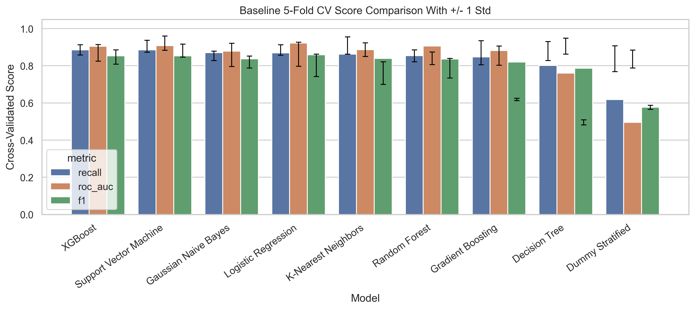
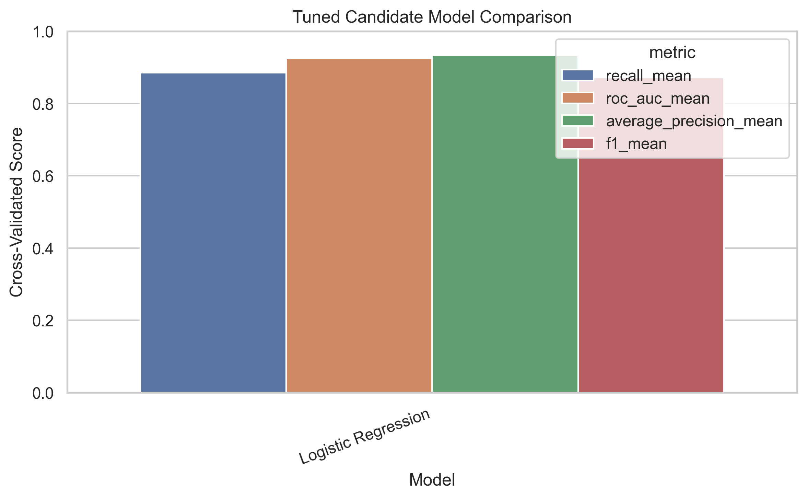
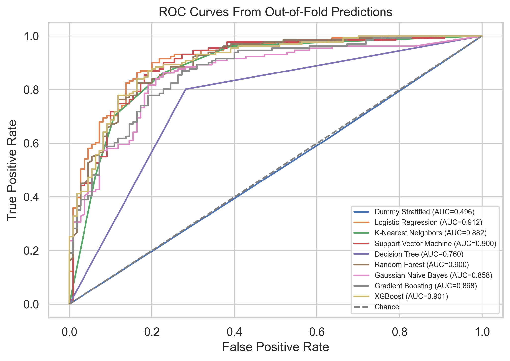
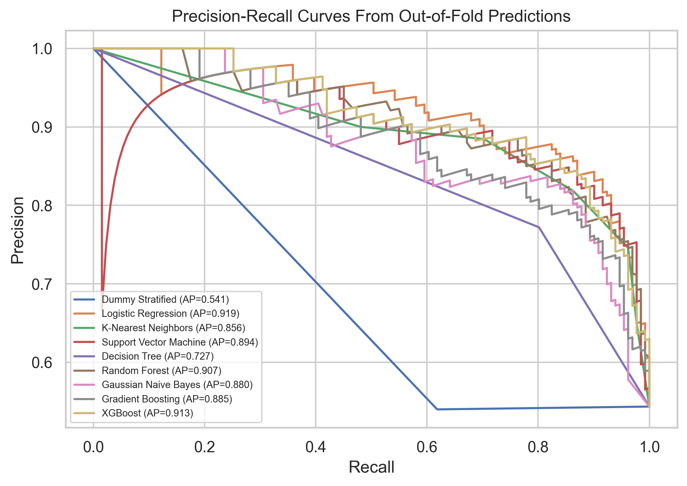
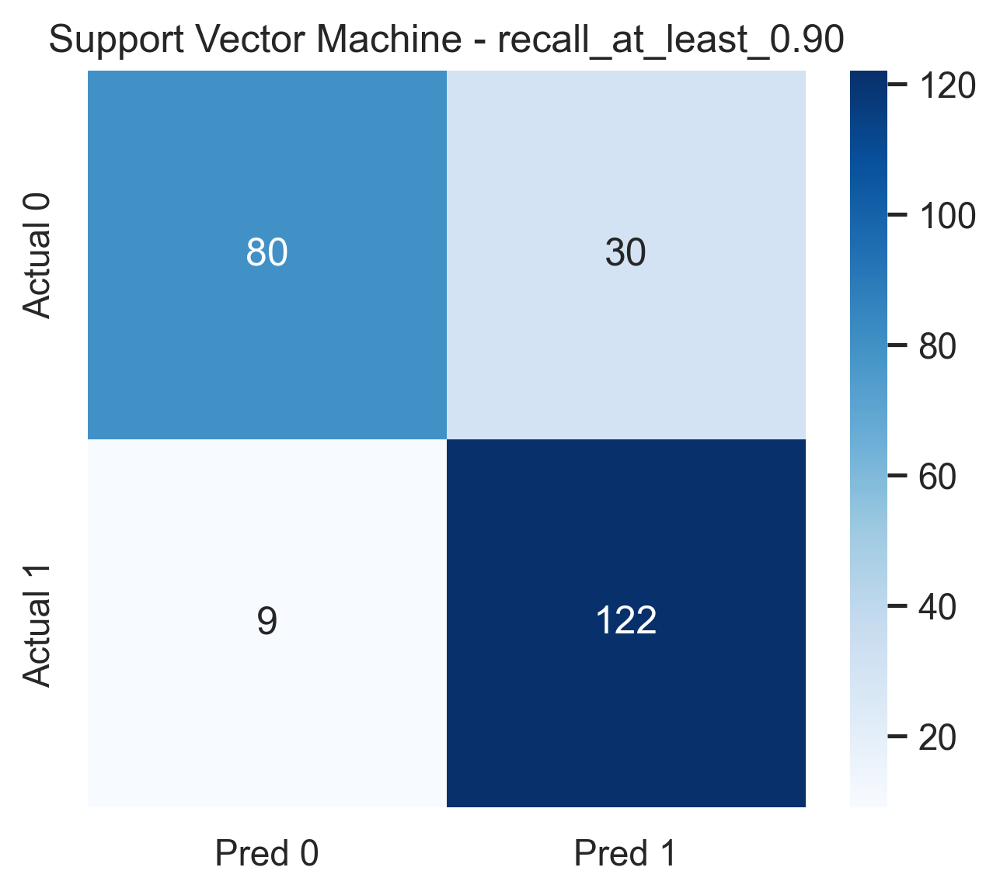
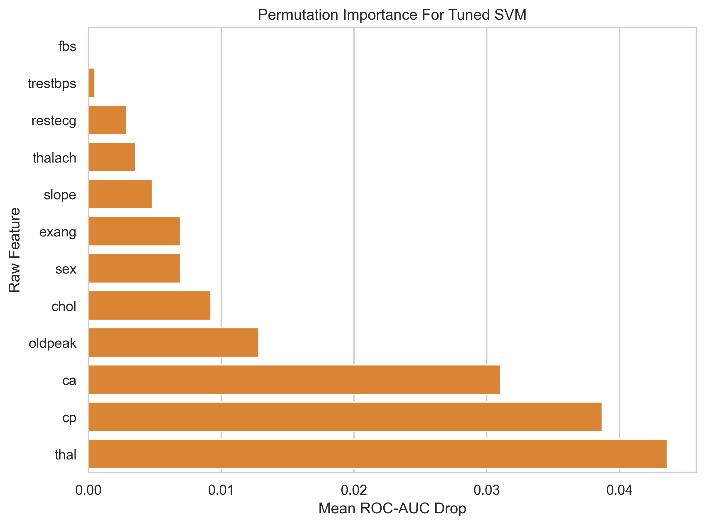

# Final Project Report - Heart Disease Risk Prediction

## Project Name

Heart Disease Risk Prediction Using Data Mining and Machine Learning

## Project Format

Single-author educational data mining project. The implementation is structured as reusable Python modules under `src/`, with generated reports, figures, and result tables stored under `reports/` and `outputs/`.

## Problem Statement

The goal is to predict whether a patient has heart disease using clinical attributes such as age, sex, chest-pain type, cholesterol, resting blood pressure, maximum heart rate, exercise-induced angina, ST depression, vessel count, and thalassemia category. The project compares multiple supervised classifiers and studies which variables appear most influential.

This work is not a diagnostic product. The Cleveland dataset is small, historical, and not representative of modern clinical populations.

## Dataset Description

- Source file: `data/raw/heart.csv`
- Raw records: 303
- Cleaned records: 302
- Features: 13 predictors plus one binary target
- Target definition: `target = 1` indicates heart disease presence; `target = 0` indicates absence
- Main cleaning issue: `ca == 4` and `thal == 0` are sentinel-encoded missing values

## Tools And Libraries

The project uses Python 3.11+, pandas, NumPy, SciPy, Matplotlib, Seaborn, scikit-learn, XGBoost, Joblib, Jupyter tooling, and Pytest. Dependencies are pinned in `requirements.txt`.

## Reproducible Workflow

1. Load and audit the raw dataset.
2. Build the data dictionary and validate categorical encodings.
3. Remove the duplicate row and decode sentinel values.
4. Lock a stratified 80/20 train/test split.
5. Run EDA, statistical association tests, and outlier review on the training split.
6. Build one shared leak-proof preprocessing pipeline.
7. Compare classifiers with stratified 5-fold cross-validation.
8. Tune the strongest candidates.
9. Evaluate out-of-fold predictions and tune thresholds.
10. Interpret the selected model with coefficients, tree importances, and permutation importance.
11. Export all figures and reports.

## Preprocessing Workflow

The preprocessing workflow is implemented as a shared `ColumnTransformer` inside every model pipeline. Imputation, scaling, and encoding are fitted inside training folds only, preventing leakage.

### Split Summary

| split   |   rows |   target_0_count |   target_1_count |   target_1_percentage |
|:--------|-------:|-----------------:|-----------------:|----------------------:|
| train   |    241 |              110 |              131 |                 54.36 |
| test    |     61 |               28 |               33 |                 54.1  |

### Column Routing

| feature   | group   | pipeline_steps                                                                                      |
|:----------|:--------|:----------------------------------------------------------------------------------------------------|
| age       | numeric | SimpleImputer(strategy='median') -> StandardScaler()                                                |
| trestbps  | numeric | SimpleImputer(strategy='median') -> StandardScaler()                                                |
| chol      | numeric | SimpleImputer(strategy='median') -> StandardScaler()                                                |
| thalach   | numeric | SimpleImputer(strategy='median') -> StandardScaler()                                                |
| oldpeak   | numeric | SimpleImputer(strategy='median') -> StandardScaler()                                                |
| cp        | nominal | SimpleImputer(strategy='most_frequent') -> OneHotEncoder(handle_unknown='ignore', drop='if_binary') |
| restecg   | nominal | SimpleImputer(strategy='most_frequent') -> OneHotEncoder(handle_unknown='ignore', drop='if_binary') |
| slope     | nominal | SimpleImputer(strategy='most_frequent') -> OneHotEncoder(handle_unknown='ignore', drop='if_binary') |
| thal      | nominal | SimpleImputer(strategy='most_frequent') -> OneHotEncoder(handle_unknown='ignore', drop='if_binary') |
| ca        | ordinal | SimpleImputer(strategy='most_frequent')                                                             |
| sex       | binary  | passthrough                                                                                         |
| fbs       | binary  | passthrough                                                                                         |
| exang     | binary  | passthrough                                                                                         |

## Classification Models

The project compares a dummy baseline against linear, distance-based, kernel, tree, ensemble, probabilistic, boosting, and gradient-boosted tabular models.

| model                  | estimator                      | notes                                                                                                         |
|:-----------------------|:-------------------------------|:--------------------------------------------------------------------------------------------------------------|
| Dummy Stratified       | DummyClassifier                | Chance-level baseline; every real model should beat it.                                                       |
| Logistic Regression    | LogisticRegression             | Linear baseline with balanced class weights.                                                                  |
| K-Nearest Neighbors    | KNeighborsClassifier           | Distance-based non-parametric classifier.                                                                     |
| Support Vector Machine | SVC                            | Margin-based classifier with probability estimates enabled.                                                   |
| Decision Tree          | DecisionTreeClassifier         | Interpretable tree baseline.                                                                                  |
| Random Forest          | RandomForestClassifier         | Bagged tree ensemble with balanced class weights.                                                             |
| Gaussian Naive Bayes   | GaussianNB                     | Included for lab coverage; GaussianNB assumes continuous features, which is imperfect after one-hot encoding. |
| Gradient Boosting      | GradientBoostingClassifier     | Scikit-learn boosted tree baseline.                                                                           |
| XGBoost                | SklearnCompatibleXGBClassifier | Industry-standard boosted tree classifier for tabular data.                                                   |

## Baseline Cross-Validation Results

Baseline model selection uses stratified 5-fold cross-validation on the training split. The top baseline by recall is XGBoost with recall 0.885, ROC-AUC 0.905, and F1 0.853.

| model                  |   accuracy_mean |   accuracy_std |   precision_mean |   precision_std |   recall_mean |   recall_std |   f1_mean |   f1_std |   roc_auc_mean |   roc_auc_std |   average_precision_mean |   average_precision_std |
|:-----------------------|----------------:|---------------:|-----------------:|----------------:|--------------:|-------------:|----------:|---------:|---------------:|--------------:|-------------------------:|------------------------:|
| XGBoost                |        0.834099 |       0.032375 |         0.825048 |        0.044996 |      0.88547  |     0.027263 |  0.853404 | 0.024995 |       0.904856 |      0.032022 |                 0.919957 |                0.021075 |
| Support Vector Machine |        0.834014 |       0.039005 |         0.824594 |        0.047532 |      0.885185 |     0.028214 |  0.853292 | 0.032072 |       0.908638 |      0.046205 |                 0.910691 |                0.053101 |
| Gaussian Naive Bayes   |        0.813691 |       0.089127 |         0.812465 |        0.099306 |      0.870085 |     0.064642 |  0.837674 | 0.069837 |       0.878982 |      0.051329 |                 0.901076 |                0.038239 |
| Logistic Regression    |        0.842177 |       0.076265 |         0.849337 |        0.086084 |      0.8698   |     0.044737 |  0.858436 | 0.062333 |       0.921717 |      0.038504 |                 0.934301 |                0.031298 |
| K-Nearest Neighbors    |        0.821599 |       0.037673 |         0.822547 |        0.049388 |      0.862108 |     0.065048 |  0.839766 | 0.034073 |       0.886299 |      0.036374 |                 0.864116 |                0.040776 |
| Random Forest          |        0.817177 |       0.058461 |         0.821258 |        0.067313 |      0.854416 |     0.051138 |  0.836081 | 0.047891 |       0.905795 |      0.043056 |                 0.918996 |                0.028793 |
| Gradient Boosting      |        0.796599 |       0.050088 |         0.799866 |        0.069602 |      0.847293 |     0.038546 |  0.820388 | 0.032214 |       0.881507 |      0.034852 |                 0.906082 |                0.024033 |
| Decision Tree          |        0.76352  |       0.059798 |         0.773872 |        0.059393 |      0.801994 |     0.06057  |  0.786732 | 0.052241 |       0.760088 |      0.061047 |                 0.729795 |                0.057412 |
| Dummy Stratified       |        0.506122 |       0.01369  |         0.54     |        0.014907 |      0.618234 |     0.006371 |  0.576441 | 0.011208 |       0.49548  |      0.013349 |                 0.541405 |                0.010882 |

## Hyperparameter Tuning Results

The tuned shortlist contains Logistic Regression, Support Vector Machine, and XGBoost. The selected tuned candidate is Support Vector Machine.

- Selected parameters: `{"clf__C": 0.1, "clf__gamma": "scale", "clf__kernel": "linear"}`
- Tuned recall: 0.908
- Tuned ROC-AUC: 0.921
- Tuned F1: 0.876

| model                  | best_params                                                                 |   best_refit_score |   accuracy_mean |   accuracy_std |   precision_mean |   precision_std |   recall_mean |   recall_std |   f1_mean |   f1_std |   roc_auc_mean |   roc_auc_std |   average_precision_mean |   average_precision_std |
|:-----------------------|:----------------------------------------------------------------------------|-------------------:|----------------:|---------------:|-----------------:|----------------:|--------------:|-------------:|----------:|---------:|---------------:|--------------:|-------------------------:|------------------------:|
| Support Vector Machine | {"clf__C": 0.1, "clf__gamma": "scale", "clf__kernel": "linear"}             |           0.921031 |        0.859014 |       0.054669 |         0.846551 |        0.058653 |      0.908262 |     0.039463 |  0.875794 | 0.046373 |       0.921031 |      0.037555 |                 0.928812 |                0.034115 |
| XGBoost                | {"clf__learning_rate": 0.05, "clf__max_depth": 2, "clf__n_estimators": 100} |           0.916175 |        0.85051  |       0.042803 |         0.843433 |        0.047318 |      0.892877 |     0.038164 |  0.866798 | 0.036614 |       0.916175 |      0.031525 |                 0.926632 |                0.023179 |
| Logistic Regression    | {"clf__C": 0.1, "clf__penalty": "l2", "clf__solver": "lbfgs"}               |           0.924501 |        0.858844 |       0.048419 |         0.859878 |        0.047782 |      0.885185 |     0.042665 |  0.872185 | 0.043697 |       0.924501 |      0.038629 |                 0.933305 |                0.036493 |

## Evaluation Metrics And Threshold Analysis

Because this is a medical screening-style problem, recall is prioritized over accuracy. A false negative means a heart-disease-positive patient is missed; a false positive means a patient may receive unnecessary follow-up.

The table below uses out-of-fold training predictions only. The held-out test set remains locked at this documentation stage and should be evaluated once during final packaging/model-card generation.

| model                  |   threshold |   accuracy |   precision |   recall |   specificity |       f1 |   roc_auc |   average_precision |   true_negative |   false_positive |   false_negative |   true_positive |
|:-----------------------|------------:|-----------:|------------:|---------:|--------------:|---------:|----------:|--------------------:|----------------:|-----------------:|-----------------:|----------------:|
| XGBoost                |         0.5 |   0.834025 |    0.822695 | 0.885496 |      0.772727 | 0.852941 |  0.901388 |            0.91253  |              85 |               25 |               15 |             116 |
| Support Vector Machine |         0.5 |   0.834025 |    0.827338 | 0.877863 |      0.781818 | 0.851852 |  0.899931 |            0.894299 |              86 |               24 |               16 |             115 |
| Logistic Regression    |         0.5 |   0.842324 |    0.844444 | 0.870229 |      0.809091 | 0.857143 |  0.912422 |            0.918929 |              89 |               21 |               17 |             114 |
| Gaussian Naive Bayes   |         0.5 |   0.813278 |    0.802817 | 0.870229 |      0.745455 | 0.835165 |  0.857946 |            0.880244 |              82 |               28 |               17 |             114 |
| Random Forest          |         0.5 |   0.817427 |    0.81295  | 0.862595 |      0.763636 | 0.837037 |  0.899549 |            0.906791 |              84 |               26 |               18 |             113 |
| K-Nearest Neighbors    |         0.5 |   0.821577 |    0.818841 | 0.862595 |      0.772727 | 0.840149 |  0.881541 |            0.856275 |              85 |               25 |               18 |             113 |
| Gradient Boosting      |         0.5 |   0.79668  |    0.792857 | 0.847328 |      0.736364 | 0.819188 |  0.867939 |            0.885001 |              81 |               29 |               20 |             111 |
| Decision Tree          |         0.5 |   0.763485 |    0.772059 | 0.801527 |      0.718182 | 0.786517 |  0.759854 |            0.72671  |              79 |               31 |               26 |             105 |
| Dummy Stratified       |         0.5 |   0.506224 |    0.54     | 0.618321 |      0.372727 | 0.576512 |  0.495524 |            0.541362 |              41 |               69 |               50 |              81 |

### Selected Model Operating Points

| model                  | operating_point      |   threshold |   accuracy |   precision |   recall |   specificity |       f1 |   roc_auc |   average_precision |   true_negative |   false_positive |   false_negative |   true_positive |
|:-----------------------|:---------------------|------------:|-----------:|------------:|---------:|--------------:|---------:|----------:|--------------------:|----------------:|-----------------:|-----------------:|----------------:|
| Support Vector Machine | default_0.50         |         0.5 |   0.834025 |    0.827338 | 0.877863 |      0.781818 | 0.851852 |  0.899931 |            0.894299 |              86 |               24 |               16 |             115 |
| Support Vector Machine | max_f1               |         0.4 |   0.838174 |    0.802632 | 0.931298 |      0.727273 | 0.862191 |  0.899931 |            0.894299 |              80 |               30 |                9 |             122 |
| Support Vector Machine | recall_at_least_0.90 |         0.4 |   0.838174 |    0.802632 | 0.931298 |      0.727273 | 0.862191 |  0.899931 |            0.894299 |              80 |               30 |                9 |             122 |

## Feature Importance And Observations

The strongest recurring predictors are thalassemia category, chest-pain type, number of major vessels, exercise-induced angina, `oldpeak`, maximum heart rate, sex, and slope. These are predictive associations in this dataset, not causal medical conclusions.

| method                                 | top_features                                                       | interpretation                                                              |
|:---------------------------------------|:-------------------------------------------------------------------|:----------------------------------------------------------------------------|
| Tuned SVM coefficients                 | cp_0.0, thal_2.0, ca, thal_3.0, exang, sex, oldpeak, cp_2.0        | Largest absolute linear effects in the selected tuned model.                |
| Tuned Logistic Regression coefficients | cp_0.0, thal_2.0, ca, thal_3.0, sex, exang, oldpeak, cp_2.0        | Linear coefficient sanity check from a strong calibrated baseline.          |
| Tuned XGBoost importances              | thal_2.0, cp_0.0, ca, exang, thalach, oldpeak, thal_3.0, slope_2.0 | Tree-based split/gain importance from the strongest boosted-tree candidate. |
| Permutation importance                 | thal, cp, ca, oldpeak, chol, sex, exang, slope                     | Model-agnostic ROC-AUC drop after shuffling raw input features.             |

### Final Candidate Permutation Importance

| model                  | feature   |   importance_mean |   importance_std |
|:-----------------------|:----------|------------------:|-----------------:|
| Support Vector Machine | thal      |       0.0436086   |      0.0129685   |
| Support Vector Machine | cp        |       0.0386954   |      0.00778657  |
| Support Vector Machine | ca        |       0.0310618   |      0.00967065  |
| Support Vector Machine | oldpeak   |       0.0128383   |      0.00469295  |
| Support Vector Machine | chol      |       0.00922276  |      0.00405668  |
| Support Vector Machine | sex       |       0.00693616  |      0.00310896  |
| Support Vector Machine | exang     |       0.00692575  |      0.00340095  |
| Support Vector Machine | slope     |       0.00480569  |      0.00279968  |
| Support Vector Machine | thalach   |       0.00355309  |      0.00203529  |
| Support Vector Machine | restecg   |       0.00288341  |      0.00198799  |
| Support Vector Machine | trestbps  |       0.000496183 |      0.000529542 |
| Support Vector Machine | fbs       |       5.89868e-05 |      0.000339457 |
| Support Vector Machine | age       |      -0.000117974 |      0.000805445 |

## Visual Deliverables

The project exports 300 dpi PNG figures for EDA, outlier diagnostics, model evaluation, tuning, interpretation, and visualization QA.

| figure                                                               | relative_path                                                                        |   width_px |   height_px |   file_size_bytes |
|:---------------------------------------------------------------------|:-------------------------------------------------------------------------------------|-----------:|------------:|------------------:|
| eda_age_distribution_by_target.png                                   | outputs/figures/eda_age_distribution_by_target.png                                   |       2053 |        1154 |            144542 |
| eda_age_group_target_rate.png                                        | outputs/figures/eda_age_group_target_rate.png                                        |       2054 |        1155 |             79226 |
| eda_chest_pain_vs_target.png                                         | outputs/figures/eda_chest_pain_vs_target.png                                         |       2652 |        1155 |            135621 |
| eda_cholesterol_by_target.png                                        | outputs/figures/eda_cholesterol_by_target.png                                        |       1753 |        1154 |             75805 |
| eda_exang_vs_target.png                                              | outputs/figures/eda_exang_vs_target.png                                              |       2052 |        1155 |             96459 |
| eda_mutual_information.png                                           | outputs/figures/eda_mutual_information.png                                           |       2052 |        1454 |             85906 |
| eda_pearson_correlation_heatmap.png                                  | outputs/figures/eda_pearson_correlation_heatmap.png                                  |       1959 |        1453 |            182559 |
| eda_sex_target_rate.png                                              | outputs/figures/eda_sex_target_rate.png                                              |       1754 |        1154 |             65428 |
| eda_target_distribution.png                                          | outputs/figures/eda_target_distribution.png                                          |       1752 |        1154 |             63520 |
| eda_thalach_by_target.png                                            | outputs/figures/eda_thalach_by_target.png                                            |       1752 |        1154 |             71468 |
| evaluation_confusion_support_vector_machine_default_0.50.png         | outputs/figures/evaluation_confusion_support_vector_machine_default_0.50.png         |       1287 |        1153 |             56180 |
| evaluation_confusion_support_vector_machine_recall_at_least_0.90.png | outputs/figures/evaluation_confusion_support_vector_machine_recall_at_least_0.90.png |       1287 |        1153 |             61095 |
| evaluation_confusion_xgboost_default_0.50.png                        | outputs/figures/evaluation_confusion_xgboost_default_0.50.png                        |       1287 |        1153 |             52310 |
| evaluation_confusion_xgboost_recall_at_least_0.90.png                | outputs/figures/evaluation_confusion_xgboost_recall_at_least_0.90.png                |       1287 |        1153 |             56282 |
| evaluation_oof_metric_comparison.png                                 | outputs/figures/evaluation_oof_metric_comparison.png                                 |       3252 |        1454 |            249872 |
| evaluation_precision_recall_curves.png                               | outputs/figures/evaluation_precision_recall_curves.png                               |       2052 |        1454 |            304714 |
| evaluation_roc_curves.png                                            | outputs/figures/evaluation_roc_curves.png                                            |       2052 |        1454 |            255254 |
| evaluation_threshold_sweep.png                                       | outputs/figures/evaluation_threshold_sweep.png                                       |       2652 |        1454 |            275160 |
| interpret_logistic_coefficients.png                                  | outputs/figures/interpret_logistic_coefficients.png                                  |       2352 |        1754 |            135087 |
| interpret_permutation_importance.png                                 | outputs/figures/interpret_permutation_importance.png                                 |       2352 |        1754 |             96861 |
| interpret_svm_coefficients.png                                       | outputs/figures/interpret_svm_coefficients.png                                       |       2350 |        1754 |            130889 |
| interpret_xgboost_importances.png                                    | outputs/figures/interpret_xgboost_importances.png                                    |       2353 |        1754 |            106057 |
| outliers_age_histogram_kde.png                                       | outputs/figures/outliers_age_histogram_kde.png                                       |       2053 |        1154 |            135103 |
| outliers_boxplots_by_target.png                                      | outputs/figures/outliers_boxplots_by_target.png                                      |       5352 |        1154 |            176830 |
| outliers_chol_histogram_kde.png                                      | outputs/figures/outliers_chol_histogram_kde.png                                      |       2052 |        1154 |            152181 |
| outliers_numeric_boxplots.png                                        | outputs/figures/outliers_numeric_boxplots.png                                        |       2352 |        3554 |            164781 |
| outliers_oldpeak_histogram_kde.png                                   | outputs/figures/outliers_oldpeak_histogram_kde.png                                   |       2052 |        1154 |            107754 |
| outliers_thalach_histogram_kde.png                                   | outputs/figures/outliers_thalach_histogram_kde.png                                   |       2053 |        1154 |            139791 |
| outliers_trestbps_histogram_kde.png                                  | outputs/figures/outliers_trestbps_histogram_kde.png                                  |       2053 |        1154 |            140014 |
| tuning_model_comparison.png                                          | outputs/figures/tuning_model_comparison.png                                          |       2352 |        1454 |            117744 |
| visualization_cv_score_comparison_error_bars.png                     | outputs/figures/visualization_cv_score_comparison_error_bars.png                     |       3252 |        1454 |            241512 |
| visualization_svm_calibration_curve.png                              | outputs/figures/visualization_svm_calibration_curve.png                              |       1752 |        1454 |            136755 |

## Conclusions

- The dataset is suitable for a compact, professional supervised classification study but is too small and historical for clinical deployment.
- Sentinel handling for `ca` and `thal` is the most important cleaning decision.
- The tuned linear Support Vector Machine is the current selected model because it provides the strongest recall-oriented cross-validation profile.
- A threshold of 0.40 on out-of-fold SVM predictions reaches recall above 0.90 while preserving a reasonable F1 score.
- Feature interpretation consistently highlights chest-pain type, thalassemia category, vessel count, exercise-induced angina, `oldpeak`, and maximum heart rate.

## Limitations

- The dataset contains only 303 raw records before duplicate removal.
- The data comes from a historical Cleveland Clinic subset and does not represent modern populations.
- The binary target simplifies the original heart-disease severity scale.
- Final held-out test-set evaluation and model-card packaging are intentionally deferred until the final quality step.
- The model should never be used as a substitute for professional medical diagnosis.
