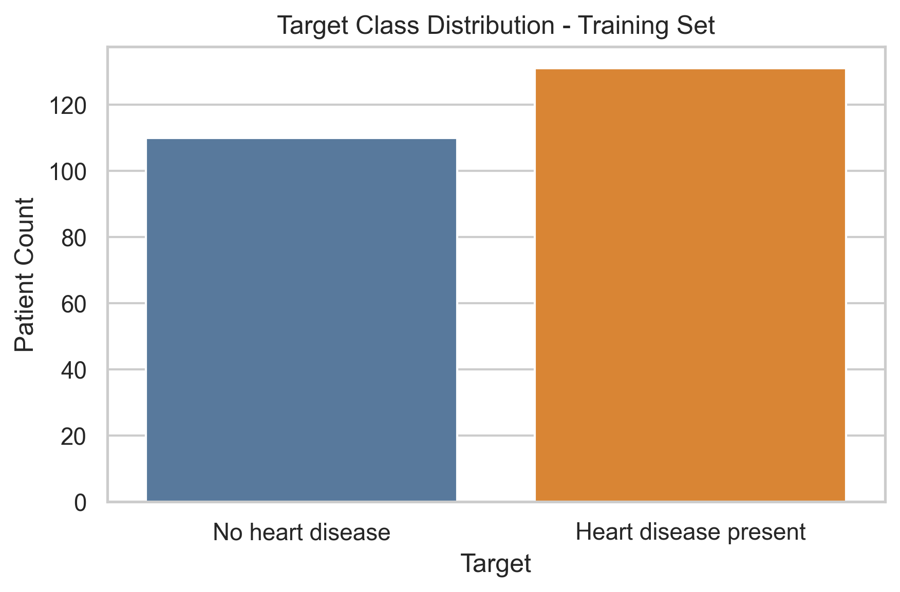
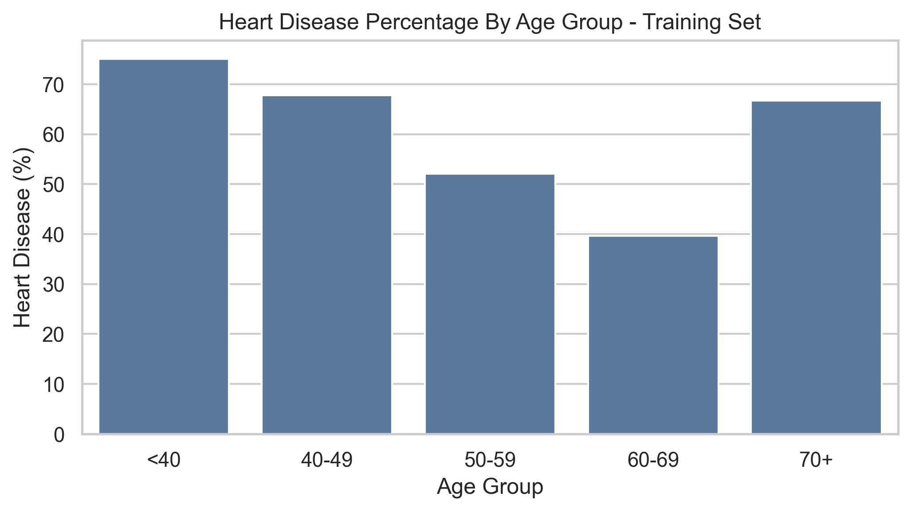
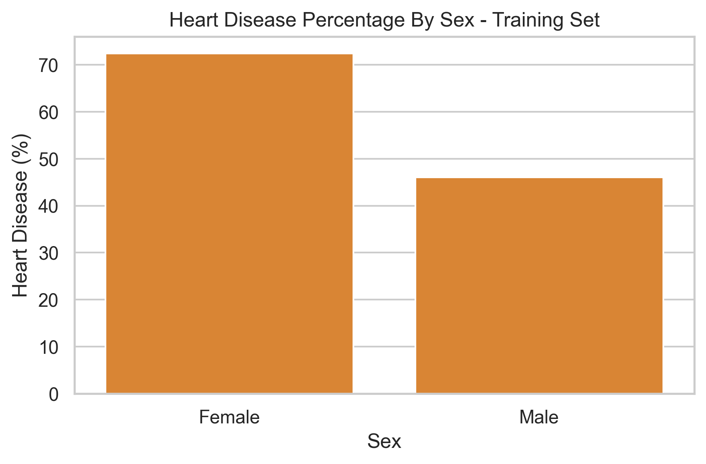
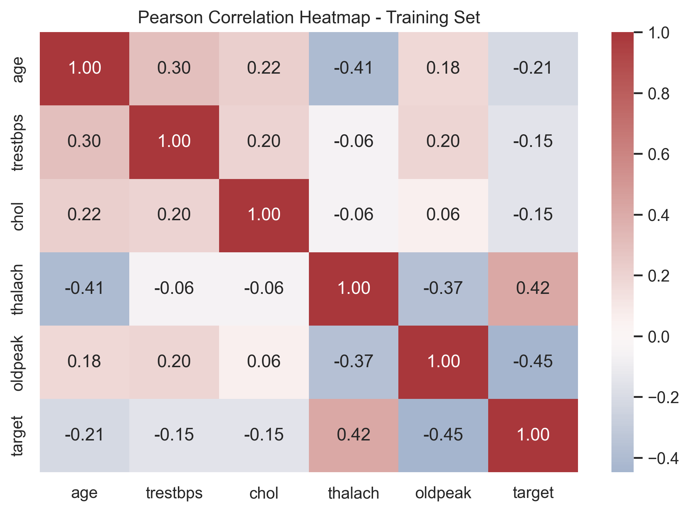
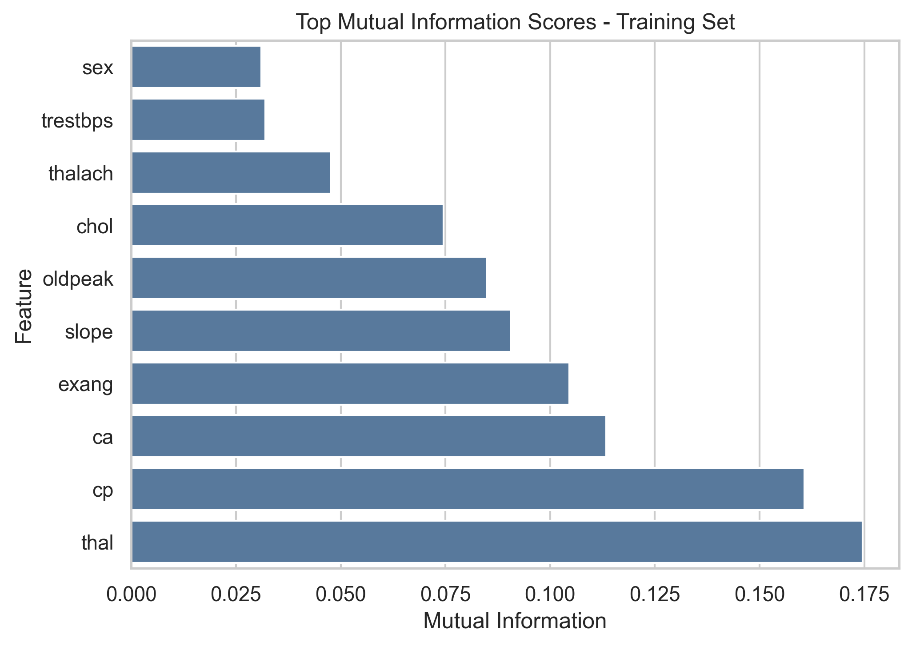
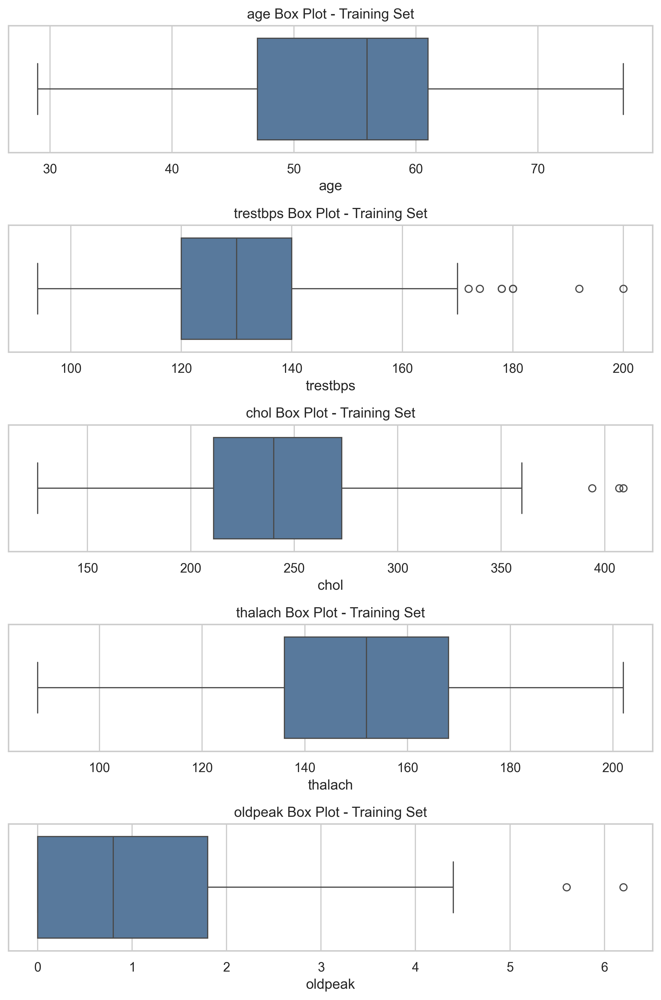

# Milestone 1 Report - Heart Disease Risk Prediction

## Project Scope

This milestone documents the data-understanding, cleaning, outlier-detection, correlation-analysis, and visual-assessment phases of the Heart Disease Risk Prediction data mining project. The work uses the processed Cleveland heart disease dataset supplied as `data/raw/heart.csv`.

This project is educational and analytical. It is not a clinical diagnostic system, screening tool, or medical recommendation engine.

## Dataset Overview

- Raw rows: 303
- Raw columns: 14
- Cleaned rows after duplicate removal: 302
- Explicit raw missing values: 0
- Missing values after sentinel decoding: 6
- Positive class count after cleaning: 164
- Negative class count after cleaning: 138

## Data Cleaning Summary

Cleaning was intentionally conservative. The duplicate row was removed before train/test splitting to prevent leakage. Sentinel-encoded missing values were decoded to `NaN` and left for the modelling pipeline to impute inside cross-validation folds.

| metric                         |   value |
|:-------------------------------|--------:|
| raw_rows                       |     303 |
| raw_columns                    |      14 |
| duplicate_rows_removed         |       1 |
| cleaned_rows                   |     302 |
| cleaned_columns                |      14 |
| raw_explicit_missing_values    |       0 |
| cleaned_missing_values         |       6 |
| sentinel_values_decoded_to_nan |       6 |
| target_0_count_after_cleaning  |     138 |
| target_1_count_after_cleaning  |     164 |

### Sentinel Decoding

| column   |   sentinel_values |   n_replaced_with_nan |
|:---------|------------------:|----------------------:|
| ca       |                 4 |                     4 |
| thal     |                 0 |                     2 |

### Numeric Range Review

| column   |   observed_min |   observed_max |   allowed_min |   allowed_max | unit             |   n_below_min |   n_above_max | status   |
|:---------|---------------:|---------------:|--------------:|--------------:|:-----------------|--------------:|--------------:|:---------|
| age      |             29 |           77   |             0 |           120 | years            |             0 |             0 | pass     |
| trestbps |             94 |          200   |             1 |           300 | mm Hg            |             0 |             0 | pass     |
| chol     |            126 |          564   |             1 |           700 | mg/dl            |             0 |             0 | pass     |
| thalach  |             71 |          202   |             1 |           250 | beats per minute |             0 |             0 | pass     |
| oldpeak  |              0 |            6.2 |             0 |            10 | ST depression    |             0 |             0 | pass     |

The cholesterol maximum is extreme but biologically plausible, so it is documented rather than removed. Resting blood pressure and `oldpeak` outliers are also preserved because the values are plausible clinical observations.

## Exploratory Visual Assessment

### Target And Demographic Patterns

The younger `<40` group has a heart-disease-positive rate of 75.00% in the training split. Female patients show a 72.37% positive rate and male patients show a 46.06% positive rate in this dataset. These are dataset-specific observations, not population-level medical claims.

| age_group   |   rows |   heart_disease_cases |   heart_disease_percentage |
|:------------|-------:|----------------------:|---------------------------:|
| <40         |     12 |                     9 |                      75    |
| 40-49       |     59 |                    40 |                      67.8  |
| 50-59       |     98 |                    51 |                      52.04 |
| 60-69       |     63 |                    25 |                      39.68 |
| 70+         |      9 |                     6 |                      66.67 |

|   sex | sex_label   |   rows |   heart_disease_cases |   heart_disease_percentage |
|------:|:------------|-------:|----------------------:|---------------------------:|
|     0 | Female      |     76 |                    55 |                      72.37 |
|     1 | Male        |    165 |                    76 |                      46.06 |

### Correlation And Association Analysis

The analysis goes beyond visual inspection by using Pearson/Spearman correlations, chi-square tests for categorical predictors, Mann-Whitney tests for numerical predictors, and mutual information scores.

#### Pearson Correlation Matrix

| feature   |    age |   trestbps |   chol |   thalach |   oldpeak |   target |
|:----------|-------:|-----------:|-------:|----------:|----------:|---------:|
| age       |  1     |      0.303 |  0.22  |    -0.406 |     0.176 |   -0.211 |
| trestbps  |  0.303 |      1     |  0.198 |    -0.059 |     0.196 |   -0.151 |
| chol      |  0.22  |      0.198 |  1     |    -0.06  |     0.057 |   -0.15  |
| thalach   | -0.406 |     -0.059 | -0.06  |     1     |    -0.369 |    0.419 |
| oldpeak   |  0.176 |      0.196 |  0.057 |    -0.369 |     1     |   -0.448 |
| target    | -0.211 |     -0.151 | -0.15  |     0.419 |    -0.448 |    1     |

#### Chi-Square Tests

| feature   |    chi2 |   p_value |   degrees_of_freedom | significant_at_0_05   |
|:----------|--------:|----------:|---------------------:|:----------------------|
| cp        | 73.2523 |  0        |                    3 | True                  |
| ca        | 51.5653 |  0        |                    3 | True                  |
| slope     | 42.1969 |  0        |                    2 | True                  |
| exang     | 46.8355 |  0        |                    1 | True                  |
| thal      | 78.6202 |  0        |                    2 | True                  |
| sex       | 13.4741 |  0.000242 |                    1 | True                  |
| restecg   | 10.3343 |  0.005701 |                    2 | True                  |
| fbs       |  0.1329 |  0.715431 |                    1 | False                 |

#### Mann-Whitney Tests

| feature   |   mann_whitney_u |   p_value | significant_at_0_05   |
|:----------|-----------------:|----------:|:----------------------|
| thalach   |           3648.5 |  0        | True                  |
| oldpeak   |          10827.5 |  0        | True                  |
| age       |           9066   |  0.000553 | True                  |
| chol      |           8520   |  0.014746 | True                  |
| trestbps  |           8251   |  0.051817 | False                 |

#### Mutual Information Scores

| feature   |   mutual_information |
|:----------|---------------------:|
| thal      |             0.174561 |
| cp        |             0.160729 |
| ca        |             0.113436 |
| exang     |             0.104632 |
| slope     |             0.09073  |
| oldpeak   |             0.084925 |
| chol      |             0.0746   |
| thalach   |             0.047741 |
| trestbps  |             0.032027 |
| sex       |             0.03103  |
| restecg   |             0.021649 |
| fbs       |             0.000626 |
| age       |             0        |

## Outlier Detection

Outliers were reviewed with both visual plots and statistical rules. No records were removed because the detected observations are plausible for a medical dataset and may contain useful predictive signal.

### IQR Summary

| feature   |   q1 |    q3 |   iqr |   lower_bound |   upper_bound |   outlier_count |   outlier_percentage |   min_outlier |   max_outlier |
|:----------|-----:|------:|------:|--------------:|--------------:|----------------:|---------------------:|--------------:|--------------:|
| age       |   47 |  61   |  14   |          26   |          82   |               0 |                 0    |         nan   |         nan   |
| trestbps  |  120 | 140   |  20   |          90   |         170   |               9 |                 3.73 |         172   |         200   |
| chol      |  211 | 273   |  62   |         118   |         366   |               3 |                 1.24 |         394   |         409   |
| thalach   |  136 | 168   |  32   |          88   |         216   |               0 |                 0    |         nan   |         nan   |
| oldpeak   |    0 |   1.8 |   1.8 |          -2.7 |           4.5 |               2 |                 0.83 |           5.6 |           6.2 |

### Z-Score Summary

| feature   |    mean |    std |   threshold |   outlier_count |   outlier_percentage |   min_outlier |   max_outlier |
|:----------|--------:|-------:|------------:|----------------:|---------------------:|--------------:|--------------:|
| age       |  54.34  |  9.201 |           3 |               0 |                 0    |         nan   |         nan   |
| trestbps  | 131.448 | 17.951 |           3 |               2 |                 0.83 |         192   |         200   |
| chol      | 244.299 | 48.006 |           3 |               3 |                 1.24 |         394   |         409   |
| thalach   | 150.071 | 22.041 |           3 |               0 |                 0    |         nan   |         nan   |
| oldpeak   |   1.071 |  1.204 |           3 |               2 |                 0.83 |           5.6 |           6.2 |

### Treatment Recommendation

| feature   |   iqr_outlier_count | recommendation     | rationale                                                                                                                         |
|:----------|--------------------:|:-------------------|:----------------------------------------------------------------------------------------------------------------------------------|
| age       |                   0 | No action          | No IQR outliers were detected in the training split.                                                                              |
| trestbps  |                   9 | Keep for modelling | Detected values are clinically plausible extremes in this dataset. Document them and let robust validation decide model behavior. |
| chol      |                   3 | Keep for modelling | Detected values are clinically plausible extremes in this dataset. Document them and let robust validation decide model behavior. |
| thalach   |                   0 | No action          | No IQR outliers were detected in the training split.                                                                              |
| oldpeak   |                   2 | Keep for modelling | Detected values are clinically plausible extremes in this dataset. Document them and let robust validation decide model behavior. |

## Visualization Coverage

All required visualization categories are covered by exported PNG files under `outputs/figures/`.

| requirement                                  | figure                                                               | status            | relative_path                                                                        | exists   |
|:---------------------------------------------|:---------------------------------------------------------------------|:------------------|:-------------------------------------------------------------------------------------|:---------|
| Target class distribution bar chart          | eda_target_distribution.png                                          | complete          | outputs/figures/eda_target_distribution.png                                          | True     |
| Age distribution histogram by target         | eda_age_distribution_by_target.png                                   | complete          | outputs/figures/eda_age_distribution_by_target.png                                   | True     |
| Heart disease percentage by age group        | eda_age_group_target_rate.png                                        | complete          | outputs/figures/eda_age_group_target_rate.png                                        | True     |
| Heart disease percentage by sex              | eda_sex_target_rate.png                                              | complete          | outputs/figures/eda_sex_target_rate.png                                              | True     |
| Pearson correlation heatmap                  | eda_pearson_correlation_heatmap.png                                  | complete          | outputs/figures/eda_pearson_correlation_heatmap.png                                  | True     |
| Box plots for outlier detection              | outliers_numeric_boxplots.png                                        | complete          | outputs/figures/outliers_numeric_boxplots.png                                        | True     |
| Chest pain type vs target count plot         | eda_chest_pain_vs_target.png                                         | complete          | outputs/figures/eda_chest_pain_vs_target.png                                         | True     |
| Exercise-induced angina vs target count plot | eda_exang_vs_target.png                                              | complete          | outputs/figures/eda_exang_vs_target.png                                              | True     |
| Maximum heart rate vs target box plot        | eda_thalach_by_target.png                                            | complete          | outputs/figures/eda_thalach_by_target.png                                            | True     |
| Cholesterol vs target box plot               | eda_cholesterol_by_target.png                                        | complete          | outputs/figures/eda_cholesterol_by_target.png                                        | True     |
| Mutual information feature relevance chart   | eda_mutual_information.png                                           | complete          | outputs/figures/eda_mutual_information.png                                           | True     |
| Model CV-score comparison with error bars    | visualization_cv_score_comparison_error_bars.png                     | complete          | outputs/figures/visualization_cv_score_comparison_error_bars.png                     | True     |
| ROC curve overlay                            | evaluation_roc_curves.png                                            | complete          | outputs/figures/evaluation_roc_curves.png                                            | True     |
| Precision-recall curve overlay               | evaluation_precision_recall_curves.png                               | complete          | outputs/figures/evaluation_precision_recall_curves.png                               | True     |
| Confusion matrix heatmaps for top models     | evaluation_confusion_support_vector_machine_recall_at_least_0.90.png | complete          | outputs/figures/evaluation_confusion_support_vector_machine_recall_at_least_0.90.png | True     |
| Feature importance chart for final candidate | interpret_permutation_importance.png                                 | complete          | outputs/figures/interpret_permutation_importance.png                                 | True     |
| Calibration plot for final candidate         | visualization_svm_calibration_curve.png                              | complete_optional | outputs/figures/visualization_svm_calibration_curve.png                              | True     |

## Milestone 1 Conclusion

The dataset is small, mostly clean, and mildly imbalanced. The main cleaning risk is not explicit missingness but sentinel-encoded missing values in `ca` and `thal`. The strongest early analytical signals come from chest-pain type, thalassemia category, exercise-induced angina, vessel count, `oldpeak`, and maximum heart rate. Outliers are documented and preserved for modelling.
